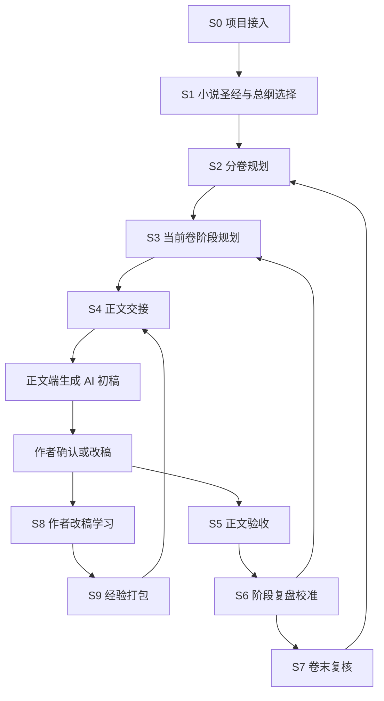

# 小说沉入工程 / Novel Immersion Engine

> Project container + reasoning executor for long-form fiction.

`小说沉入工程` 不是“和 AI 聊天写小说”的玩具。它是一套把长篇小说拆成可追踪项目的工程化工作流：用 `workflow` 保存小说状态，用 `skill` 驱动 AI 做推理、交接、正文执行、验收与复盘学习。

它的目标不是替代作者，而是把 AI 最擅长的繁重推理变成稳定流程：总纲、分卷、阶段、章节蓝图、人物变化、关系变化、伏笔、认知边界、物品/能力效果、正文交接、作者改稿学习和后续路线校准。

## 核心架构

```text
workflow/        项目容器：保存素材、规划、正文、账本、验收、复盘、经验包
skill/           推理执行器：给 Codex / Claude Code / GPT / Claude 使用的三件技能
docs/            使用说明：安装、正文端配合、完整工作流
```

三件技能各司其职：

| 技能 | 角色 | 负责什么 |
| --- | --- | --- |
| `novel-immersion-engine` | 策划端 | 接管项目，推演总纲、分卷、阶段、章节蓝图、交接包、验收和校准 |
| `novel-prose-renderer` | 正文端 | 按交接包写小说正文，保留想象力，避免说明书腔 |
| `novel-revision-learning-loop` | 学习端 | 对照蓝图、AI 初稿和作者终稿，沉淀总体创作经验与文笔执行经验 |

## 状态机

这是系统的硬核部分：每本小说不是一段聊天记录，而是一个可推进的状态机。

| 状态 | 节点 | 写入位置 | 通过条件 |
| --- | --- | --- | --- |
| S0 | 项目接入 | `01-输入素材` | 已放入想法、大纲或已有正文 |
| S1 | 小说圣经与总纲选择 | `02-小说圣经与总纲` | 作者选择一个总纲方向 |
| S2 | 分卷规划 | `03-分卷与阶段规划/分卷纲.md` | 分卷目标、高潮、伏笔和变化成立 |
| S3 | 当前卷阶段规划 | `03-分卷与阶段规划` | 当前卷被拆成可连续推进的阶段 |
| S4 | 正文交接 | `05-正文交接包` | 章节蓝图包含固定锚点、边界内创造和开放创造位 |
| S5 | 正文验收 | `08-验收与状态增量` | 正文通过交接包、状态、账本和越界检查 |
| S6 | 阶段复盘校准 | `09-阶段复盘与校准` | 已接受正文反哺尚未写出的路线 |
| S7 | 卷末复核 | `09-阶段复盘与校准/卷末复核模板.md` | 本卷承诺、代价、人物变化和下一卷压力闭合 |
| S8 | 作者改稿学习 | `11-作者改稿学习与经验包/01-作者改稿复盘` | 已有 AI 初稿、作者终稿和接受判断 |
| S9 | 经验打包 | `11-作者改稿学习与经验包/03-经验包` | 多次复盘被去内容化，沉淀为可迁移经验 |

## 运行图



## 快速启动

### 1. 新建小说项目

Windows 用户双击：

```text
workflow/新建小说项目.cmd
```

跨平台命令：

```bash
python workflow/新建小说项目.py --name "我的小说" --mode "初始想法"
```

可选模式：

| 模式 | 适用情况 |
| --- | --- |
| `初始想法` | 只有题材、设定、人物关系或一个画面 |
| `已有大纲` | 已经有自己的路线，需要强化结构和落地 |
| `已有正文` | 已写若干章节，需要反向整理后续写 |

新项目默认生成在 `workflow/项目库/`。该目录已被 `.gitignore` 保护，避免把个人正文误提交到公开仓库。

### 2. 安装技能

把 `skill/` 下的三个目录复制到你的工具技能目录：

```text
~/.codex/skills/novel-immersion-engine
~/.codex/skills/novel-prose-renderer
~/.codex/skills/novel-revision-learning-loop

~/.claude/skills/novel-immersion-engine
~/.claude/skills/novel-prose-renderer
~/.claude/skills/novel-revision-learning-loop
```

### 3. 接管项目

把素材放入新项目的 `01-输入素材`，然后在 Codex 或 Claude Code 中打开该小说项目目录，输入：

```text
请使用 $novel-immersion-engine 接管本小说项目。先读取《00-项目运行规则.md》《00-项目控制台.md》和《01-输入素材》，按控制台的下一步继续工作。不要默认直接写正文；把正式策划产物写回对应目录，并更新控制台，不要只在聊天中输出结果。
```

### 4. 生成正文

策划端生成《阶段正文交接包》后，把交接包发给 GPT / Claude / Codex 正文会话：

```text
请使用 $novel-prose-renderer 根据《阶段正文交接包》生成小说正文。只写正文，不重新策划剧情；遵守固定锚点、信息边界、人物选择、能力/物品效果和结尾落点；在边界内主动发挥场景、对白、节奏、感官和潜台词。
```

### 5. 作者改稿后学习

如果作者把 AI 初稿改成了终稿，把三份材料交给学习端：

```text
请使用 $novel-revision-learning-loop 做作者改稿复盘。对照本章交接包、AI 初稿和作者终稿，提炼总体经验增量与文笔经验增量，并更新去内容化的经验包。
```

学习结果会分成两份：

| 经验包 | 给谁用 | 内容边界 |
| --- | --- | --- |
| `整体创作经验包` | 策划端 | 如何在大纲、细纲、章节蓝图中提前安排 |
| `文笔执行经验包` | 正文端 | 如何处理句子、节奏、对白、潜台词、感官、留白和情绪 |

经验包必须去内容化：不保留私有人名、剧情、设定和原句，只保留可迁移方法。

## 仓库结构

```text
.
├── README.md
├── LICENSE
├── docs/
│   ├── 安装与开始使用.md
│   ├── 完整使用说明.md
│   └── GPT与Claude正文端使用.md
├── skill/
│   ├── novel-immersion-engine/
│   ├── novel-prose-renderer/
│   └── novel-revision-learning-loop/
└── workflow/
    ├── 新建小说项目.cmd
    ├── 新建小说项目.py
    ├── 工具/
    ├── 提示词/
    ├── 模板/
    └── 项目库/
```

## 开源前安全边界

- `workflow/项目库/*` 默认忽略，只保留 `.workflow-project-library` 标记文件。
- 模板文件只保留空白表格、字段和通用说明，不携带私人小说设定。
- 文档使用仓库相对路径，不依赖本机盘符。
- `workflow/新建小说项目.cmd` 使用 `%~dp0` 定位脚本，移动仓库目录后仍可运行。

## 分发建议

推荐双线发布：

| 渠道 | 用途 |
| --- | --- |
| GitHub | 主仓库，方便 issue、PR、版本管理和技术协作 |
| Gitee | 国内镜像，方便网文作者稳定下载压缩包 |

同步方式可以很简单：GitHub 作为主仓库，Gitee 定期同步镜像；或者本地同时添加两个 remote，发布版本时同时 push。

## License

This project is licensed under the GNU General Public License v3.0. See [LICENSE](LICENSE).

GPL v3 的重点是：可以使用、修改和分发，但基于本项目的二次分发版本也需要以 GPL v3 兼容方式开源。这能保护工作流生态继续反哺。
